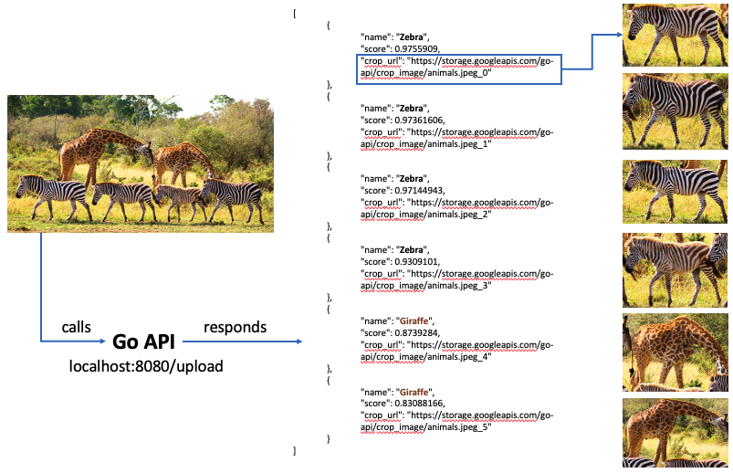
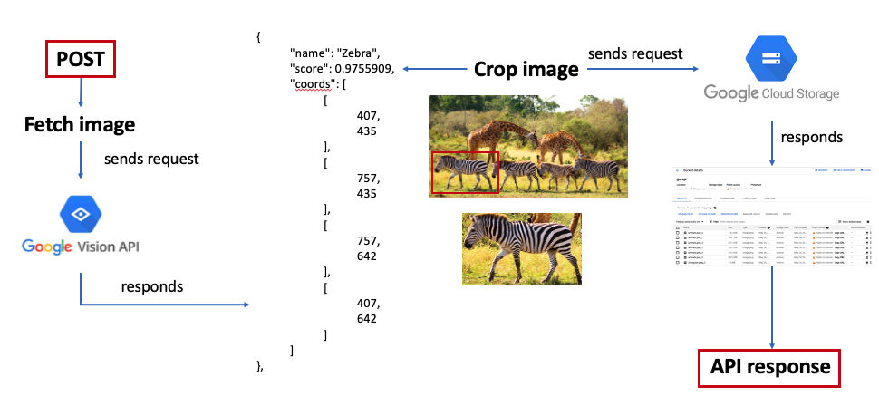

# go-api

This is a REST API written in **Go** that takes in a picture as user upload and returns a JSON file specifying objects detected in that picture and public URLs of cropped images of those objects from the original image. The service is hosted in localhost at `localhost:8080`. 

The API takes advantage of **Google Vision API** for object detection, and **Google Cloud Storage** for storing and publishing URL of cropped images.

## Video demo


## Workflow


## Code design


## Usage
1. Download dependencies with
    ```text
    go get .
    ```
2. Create a project in **[Google Cloud Service](https://console.cloud.google.com/cloud-resource-manager?_ga=2.268530744.891848580.1653918809-619279352.1649992234&_gac=1.12595653.1653918811.Cj0KCQjw1tGUBhDXARIsAIJx01kqlVJe8R7ebHrlT84NMrdy_Yt_TLnUOJKuSNrd7TU_Sj_4G0kyahwaAjvfEALw_wcB)** and enable **Cloud Vision API** in that project.
3. Create a credential for **Cloud Vision API** and save the key as a JSON file.
4. Set an environment variable named **GOOGLE_APPLICATION_CREDENTIALS** with the full path to the just downloaded JSON file. The following code is applicable for Mac/Linux. It takes a different approach for Windows, but the details of variable name and value are the same.
   ```bash
    export GOOGLE_APPLICATION_CREDENTIALS=/full/path/to/your-project-credentials.json
   ```
5. Create a **Google Cloud bucket** in the Google Cloud project you created for this project. Let everything be by default.
6. To create public accessible URL for images stored in this bucket, in **Permission** tab add a new principal
   - Name: `allUsers`
   - Role: `Storage Legacy Object Reader`
7. Everything should work fine now. Otherwise, visit [Errors](README.md#errors) section for how to fix common errors.

## Errors
1. If you encounter an error like
    ```text
    Writer.Close: googleapi: Error 403: **go-api@go-api-351011.iam.gserviceaccount.com** does not have storage.objects.create access to the Google Cloud Storage object., forbidden
    exit status 1
    ```
    Then in the **Permisison** tab add a **Principal** named, for example, **go-api@go-api-351011.iam.gserviceaccount.com** (this is specific to your project) with **Storage Admin** permission. After that, your code will have control access to the Cloud Storage.